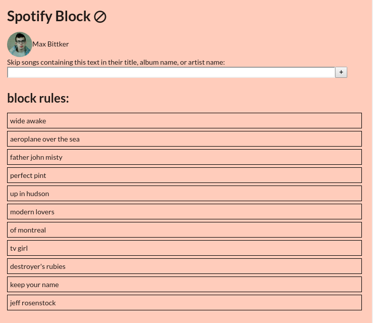

# spotify-song-block

spotify has no functionality to block songs or artists. It's also super pushy on things you might never want to hear. 

https://community.spotify.com/t5/Closed-Ideas/Block-Hide-Blacklist-tracks-or-artists/idi-p/22389

this is a way to block songs by polling your playback and automatically skipping
